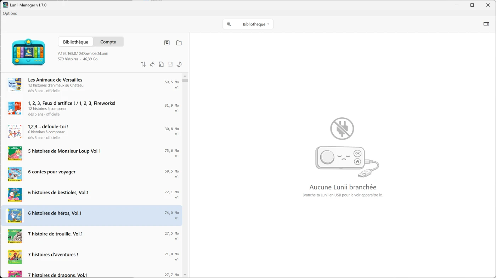
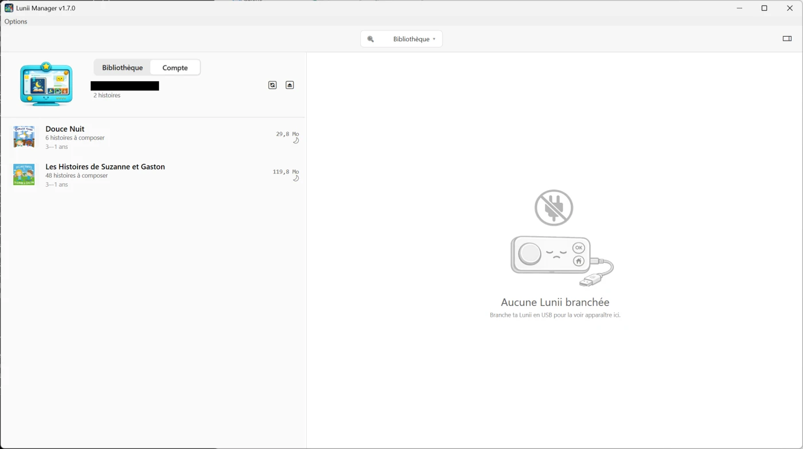
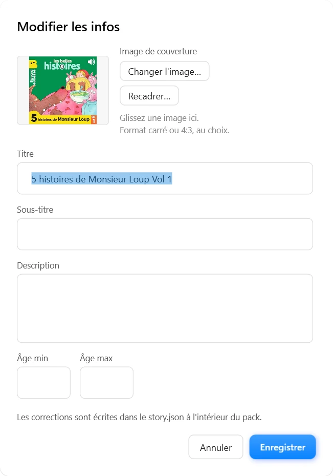
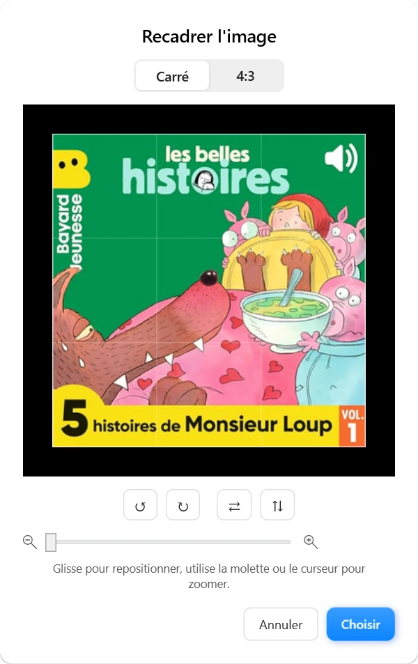
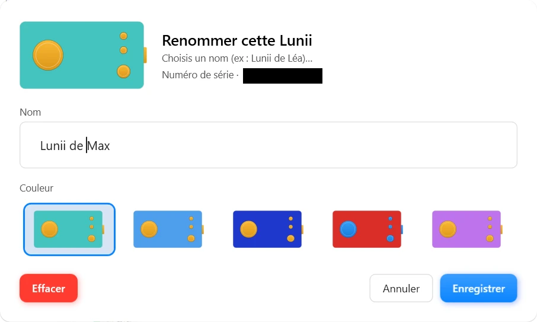
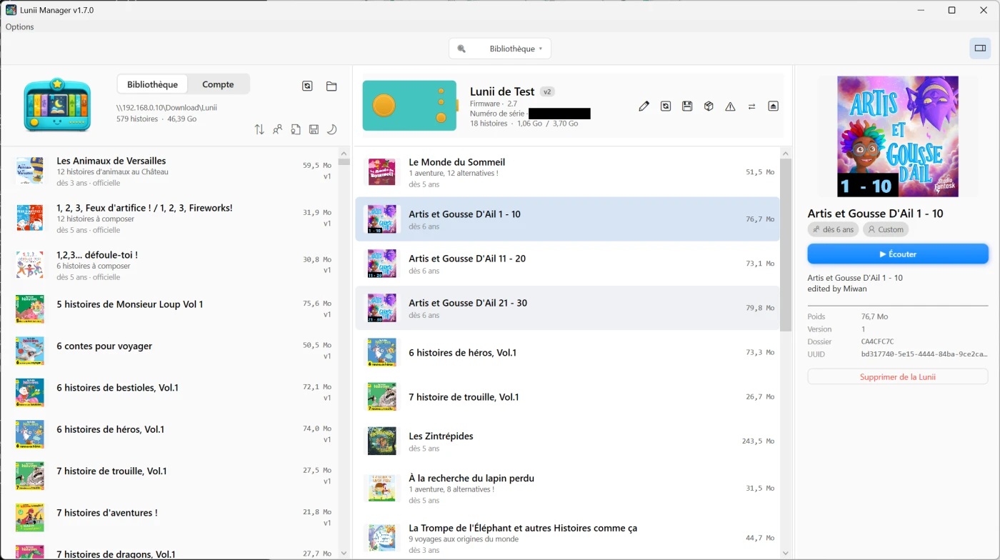
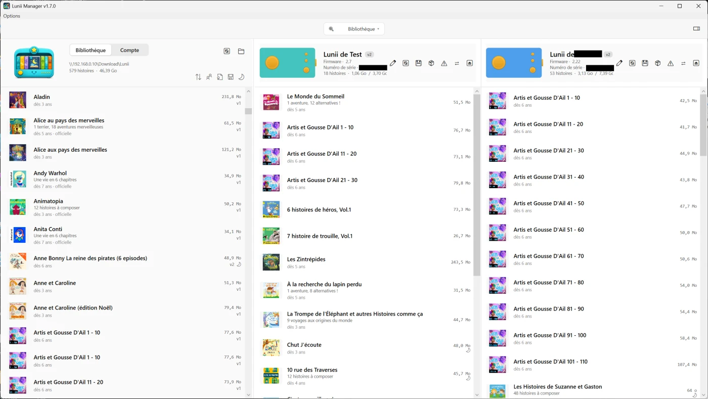
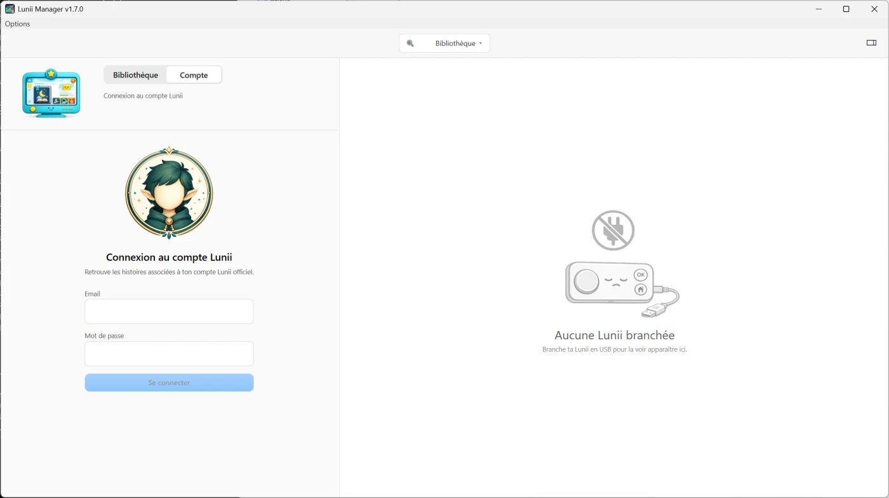
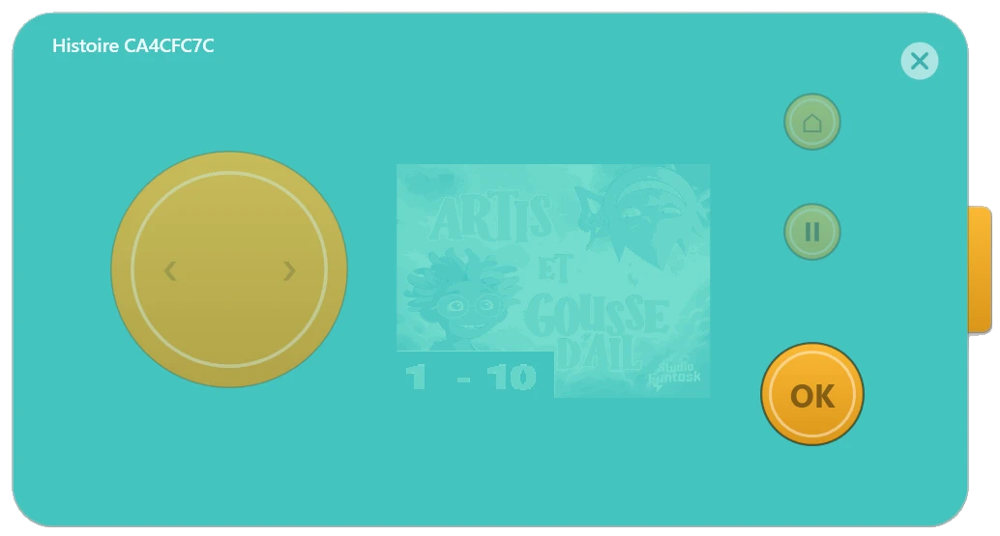

# Lunii Manager

[Download Lunii Manager 1.7.0 for Windows](https://github.com/fj81-dev/lunii-manager-win/releases/download/1.7.0/LuniiManager-Setup-1.7.0.exe) or the [standalone](https://github.com/fj81-dev/lunii-manager-win/releases/download/1.7.0/LuniiManager-1.7.0-win-x64.zip) version

A native Windows app to manage stories on your **Lunii v1 (upgraded to FW2), v2, v3 or FLAM** storyteller, without going through Luniistore.

Local library, drag-and-drop, built-in player, official Lunii account sign-in, firmware updates — all in one self-contained app that adapts to the way you actually organize your stories.

> 🍎 A **macOS** version is also available — see the [main page](https://github.com/fj81-dev/lunii-manager).

---

## What you can do

### A library you own

Keep every story you have (bought, shared, custom-made with Lunii Studio) in **one folder** — on your PC or even a network share. Lunii Manager scans the folder (and all its subfolders), shows each pack with its cover, title, age range, size, and lets you filter / sort however suits you.

- Drop in `.zip` or `.7z` archives — either Lunii Studio editor exports or the FS-backup format Lunii Manager produces itself.
- Live search on title, subtitle, description, file name or UUID.
- Filters: age range ("from 5 years", "up to 7 years"…), official vs. custom, already on the Lunii or not, night-mode availability.
- Sort by title, age, weight, date added.
- Stories built with Lunii Studio (raw editor zips) get **automatically converted** to the Lunii format (BMP images, MP3 mono audio) at install time — no third-party tools needed.

### Edit a pack's info and cover

Custom and community packs often arrive with a mangled title, no description or a placeholder cover. Right-click a non-official story — or use the detail panel — and pick **"Edit info"** to set its **title, subtitle, description and suggested age**. The changes are written straight into the pack's `story.json`, so the fix travels with the file.

Give it a real **cover** too: pick an image or drag-and-drop one onto the slot, then frame it in the built-in cropper — **square or 4:3**, pan, zoom, flip and rotate, with the surroundings dimmed. Any format (JPEG, PNG, WebP…) is converted to PNG and resized automatically.

### Effortless device management

Plug your Lunii in over USB and it shows up in the window with its nickname, color, serial number, generation (v2 / v3), firmware version and free space.

- **Rename** your Lunii ("Léa's Lunii", "Lucas's Lunii"…) and pick its real shell color.
- **Reorder stories** by drag-and-drop, push one to the top, to the bottom, or remove it with a single click.
- **Back up** the Lunii — copy all stories to your library, or to **any folder** (USB stick, NAS…).
- **Wipe** the Lunii (clears all stories, keeps the device settings).

### Everything about a story, at a glance

Select any story and the detail panel shows its cover, description, age and technical info — plus a **Listen** button, and (for your own packs) edit and a **delete** that spells out where the story is removed from: the library or the connected Lunii.

### Several Lunii at once

Plug in two (or more) and each one gets its own pane, with independent selection and its own drop target.

### Drag and drop everywhere

- Drag a story from your **library** onto your **Lunii** to copy it over.
- Drag a story from your **Lunii** back into your **library** to save it.
- Drag a story **from one Lunii to another** when two are plugged in.

### Official Lunii account

Sign in with your real Lunii account (the one on `lunii.com`) to get back every story you've bought or have through your subscription. **Multi-select** several stories (Ctrl-click / Shift-click), then right-click → "Download N stories to <Lunii>": they queue up and write to the device one after the other while you keep using the app. Stories already on the device are caught up front (one sheet listing them with their covers, then the download skips straight to the rest).

### Built-in player

Want to listen to a story without putting it on the Lunii? Click **"Listen"** from any story (library or device) and the player opens: it **looks like a real Lunii**, painted in your Lunii's color, with the wheel, OK / Home / Pause buttons and the same navigation as the real device.

It plays MP3, WAV, OGG Vorbis and FLAC. Keyboard shortcuts: left / right arrows for the wheel, Enter for OK, H for Home, Space for pause.

### Firmware updates

When the Lunii servers offer a new firmware for your device, Lunii Manager picks it up, downloads it, verifies its integrity and stages it onto the Lunii. The actual flash happens on the Lunii's next boot — exactly like Luniistore. **You can still roll back**: as long as you haven't unplugged + replugged the Lunii, open it in the file explorer and delete the `FU.BIN` / `FA.BIN` files at its root — the next boot will then ignore the staged firmware.

### Multilingual

UI translated into **French, English, German, Spanish, Italian, Portuguese, Dutch, Polish, Swedish and Danish**. Follows your Windows system language by default, or pick it manually from the **Options → Language** menu.

---

## Requirements

- **Windows 10 or 11 (64-bit).**
- **Lunii v1 (upgraded to firmware 2), v2, v3 or FLAM**, connected over USB and mounted as a drive.
  - **Lunii v1** must be upgraded to firmware 2 first (free, one-click from Luniistore). Once upgraded it takes the same USB-mass-storage path as a v2. Raw v1 firmware (pre-upgrade) is not supported.

### v3 / FLAM — what to expect

> ⚠️ **Support for v3 and FLAM is experimental for now** — the code paths are fully implemented against the reverse-engineering notes and cross-validated against the existing Java / Python reference clients, but they haven't been exercised on every device. It should work, but **back your Lunii up** before letting Lunii Manager write to it, and please report anything that misbehaves — feedback from v3 / FLAM owners is how we get this out of "experimental".

Lunii's third-generation devices (v3 color-screen and FLAM) protect their stories with per-device crypto keys baked into the microcontroller — those keys never leave the device. Most of what you'd want to do still works, but a few corners are blocked by design:

| Operation                         | Custom story (Lunii Studio, community pack)           | Official story (bought / subscription)                                                 |
|-----------------------------------|-------------------------------------------------------|----------------------------------------------------------------------------------------|
| List, reorder, delete             | ✅                                                     | ✅                                                                                      |
| Add from your library             | ✅                                                     | ✅ — only on the Lunii of origin (we tag the backup with its SNU and refuse mismatches) |
| Add from your account             | n/a                                                   | ✅                                                                                      |
| **Listen in the built-in player** | ✅                                                     | ❌ — listen on the device itself                                                        |
| **Back up to library**            | ✅ — re-importable on any Lunii (XXTEA "pivot" format) | ✅ — verbatim bytes + sidecar SNU, only re-installable on the source Lunii              |
| **Copy to another Lunii**         | ✅                                                     | ❌ — re-download it on the target from your account instead                             |

Official v3 packs show a **🔒 "Encrypted"** badge and pill in the side panel. The Play button is replaced with a disabled "Playback unavailable (encrypted)" label so you know up front the player can't open them.

---

## Installation

1. Download the installer from the releases page.
2. Run it — Lunii Manager installs and launches.
3. If Windows SmartScreen warns about an unrecognized publisher, click **More info → Run anyway** (the app isn't signed with a paid code-signing certificate).

> **Staying up to date**: **Options → Check for Updates…** asks GitHub for the latest release and offers the new installer when one's available — no background calls, only when you click.

---

## Notes

- **Free software, personal non-commercial use only.** Not affiliated with Lunii SAS — this is an independent project. *Lunii* is a trademark of Lunii SAS.
- **Piracy is not condoned.** Lunii Manager is for managing stories you legitimately own. **Official stories must be purchased from the official Lunii store** — don't download or share copyrighted packs you didn't buy. **No support will be given for anything piracy-related.**
- **If you paid for this app, you got scammed**: it's not sold anywhere.
- No external dependencies: nothing else to install. Just run the installer.

---

## License

Software provided "as is", without any warranty. All rights reserved — no redistribution, modification, sublicensing or commercial use without prior written permission.

© FJ81
